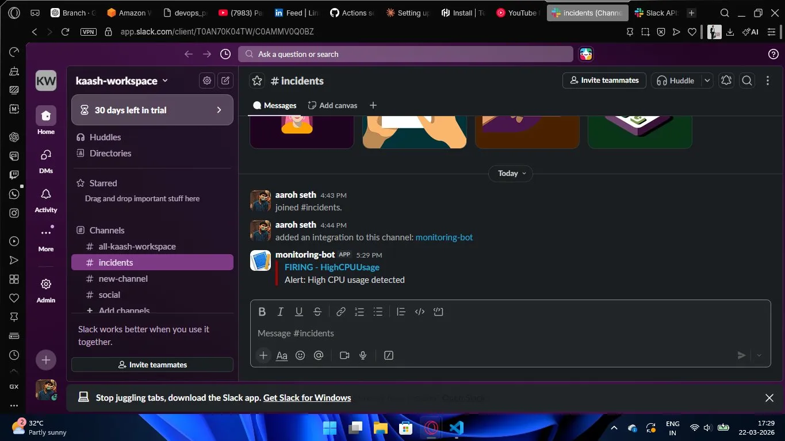
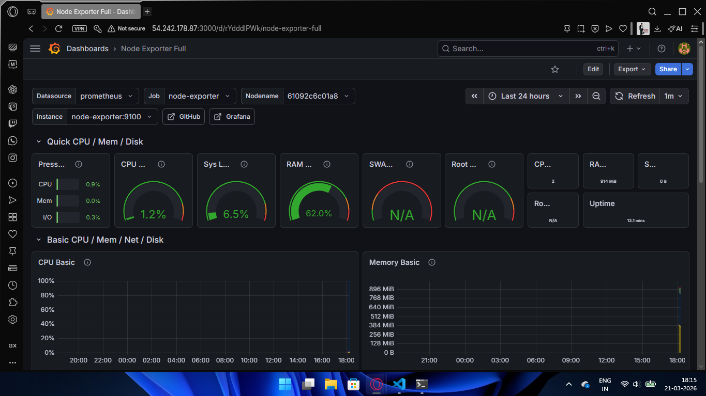
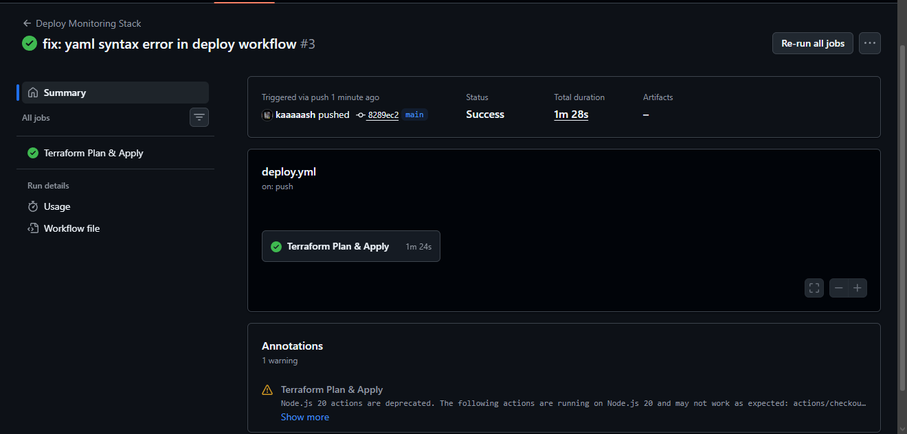
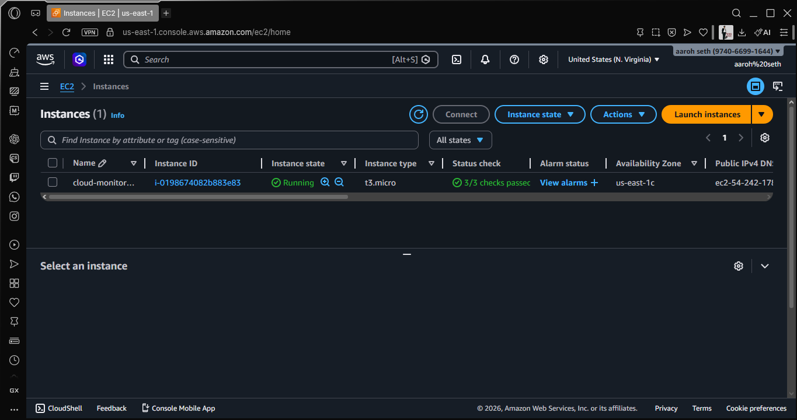
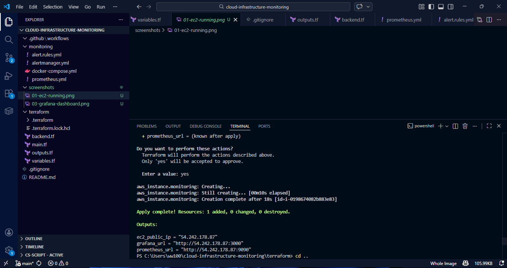
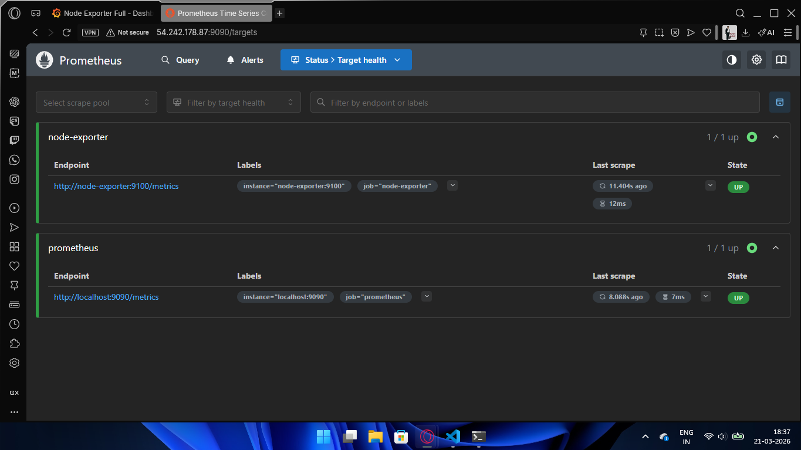
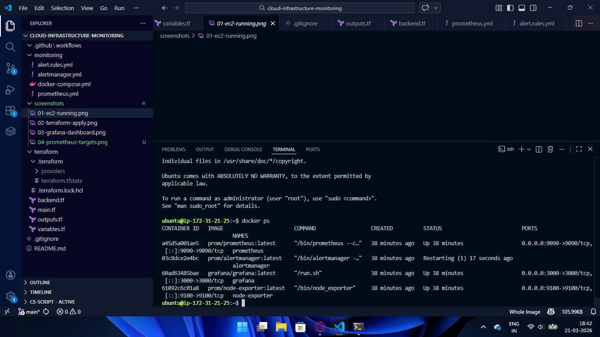
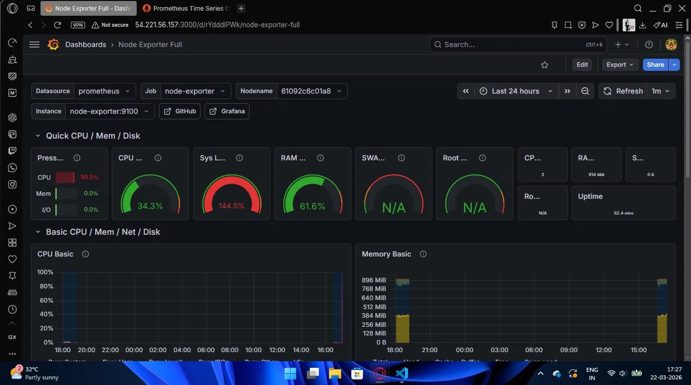
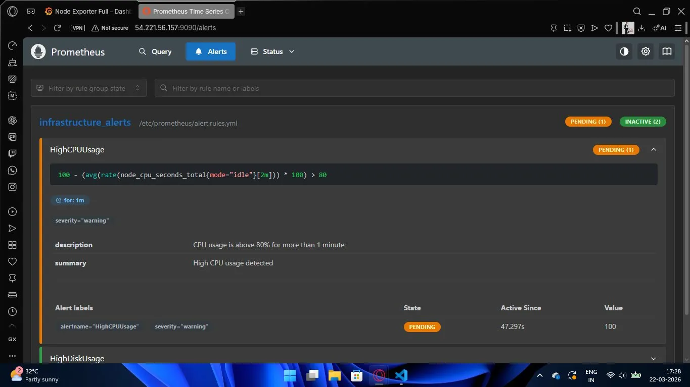

# Cloud Infrastructure Monitoring System

> *"I don't play the odds. I play the man."*
> This isn't a tutorial project. This is infrastructure that actually works.

---

## What this is

A full production-grade monitoring system — provisioned, deployed, and observable — built from scratch on AWS. Every alert, every metric, every line of Terraform was written by hand. No copy-paste. No shortcuts.

When the CPU spikes, Slack knows before you do.
When the infra breaks, one command rebuilds it.
That's not a flex. That's just how it works.

---

## The Stack


---

## Architecture

```
You push code
      ↓
GitHub Actions runs terraform plan + apply
      ↓
AWS EC2 spins up (t3.micro, free tier)
      ↓
Docker pulls and starts 4 containers
      ├── Node Exporter  → collects host metrics
      ├── Prometheus     → stores + evaluates metrics
      ├── Grafana        → visualises everything
      └── Alertmanager   → routes alerts
              ↓
    CPU > 80%? Slack gets a message.
    Problem resolved? Slack knows that too.
```

---

## The part that matters

**One command builds everything:**
```bash
terraform apply -var="ssh_public_key=$(cat ~/.ssh/monitoring-key.pub)"
```

**One command destroys everything:**
```bash
terraform destroy
```

Rebuild time: ~18 seconds. Because infrastructure should be cattle, not pets.

---

## Alerts that actually fire

When the server gets stressed, Alertmanager catches it, Prometheus confirms it, and Slack delivers it — before anyone notices.



---

## Live dashboard

Real metrics. Real server. Not a mockup.



---

## CI/CD Pipeline

Every push to `main` triggers the pipeline. Terraform plans on PRs. Terraform applies on merge. No manual deployments. Ever.



---

## How to run it yourself

```bash
# Clone
git clone https://github.com/kaaaaash/cloud-infrastructure-monitoring.git
cd cloud-infrastructure-monitoring

# Generate SSH key
ssh-keygen -t rsa -b 4096 -f ~/.ssh/monitoring-key

# Build the infra
cd terraform
terraform init
terraform apply -var="ssh_public_key=$(cat ~/.ssh/monitoring-key.pub)"

# Open Grafana at http://<EC2-IP>:3000
# Login: admin / admin

# Done with it?
terraform destroy
```

---

## Project structure

```
├── monitoring/
│   ├── docker-compose.yml    ← 4 containers, one file
│   ├── prometheus.yml        ← scrape config
│   ├── alert.rules.yml       ← CPU, memory, disk thresholds
│   └── alertmanager.yml      ← Slack routing
├── terraform/
│   ├── main.tf               ← EC2, security group, key pair
│   ├── variables.tf          ← region, instance type, AMI
│   ├── outputs.tf            ← IPs and URLs printed on apply
│   └── backend.tf            ← S3 remote state
├── .github/workflows/
│   └── deploy.yml            ← CI/CD pipeline
└── screenshots/              ← proof it works
```

---

## Screenshots

| | |
|---|---|
|  |  |
|  |  |
|  |  |

---

<div align="center">

*kaash is just a dream. but this infrastructure is very much real.*

[](https://github.com/kaaaaash)
[](https://linkedin.com/in/aarohseth)

</div>